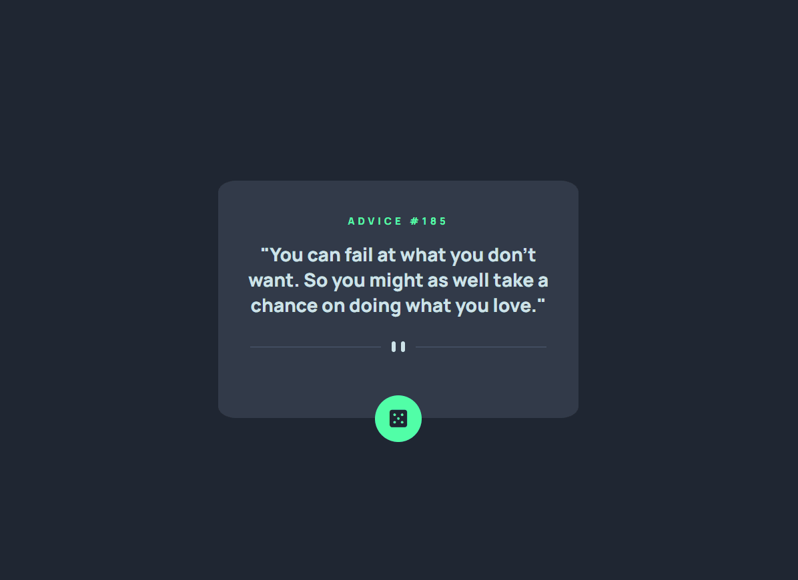
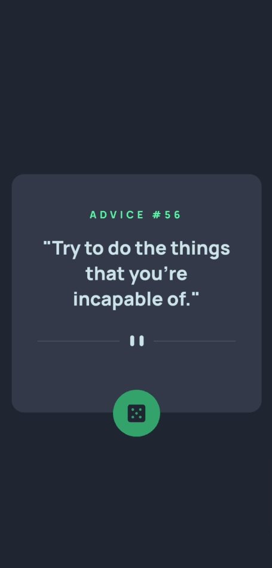

# Gerador de conselhos

A parte em HTML e CSS foi desenvolvida como um exercício no módulo "Exercícios CSS Avançado - Flexbox", enquanto a implementação em JavaScript foi parte do módulo "Exercícios JavaScript Avançado" do curso Dev Quest - Dev em Dobro

## [Vizualize o projeto clicando aqui](https://itsdavss.github.io/gerador-de-conselhos/) ##

## Table of contents

- [Visão geral](#visão-geral)
  - [Sobre](#sobre)
  - [Screenshots](#screenshots)
- [Meu processo](#meu-processo)
  - [Dificuldades e aprendizados](#dificuldades-e-aprendizados)
  - [Desenvolvido com](#desenvolvido-com)
- [Autor](#autor)

## Visão geral

### Sobre

Este site é um gerador de conselhos aleatórios. Toda vez que você clicar no botão com o ícone de dado, ele fornecerá um novo conselho

### Screenshots

#### Design Desktop

#### Design Mobile

## Meu processo

Inicialmente, desenvolvi este exercício utilizando HTML e CSS para testar meus conhecimentos, especialmente em Flexbox. Após me aprofundar em JavaScript, retornei ao projeto para aplicar uma lógica que consumisse a API AdviceSlip, aprimorando a funcionalidade e a interatividade do site

### Dificuldades e aprendizados

A única dificuldade que encontrei durante o desenvolvimento com HTML e CSS foi não ter utilizado a propriedade `transform: translateY(80%)` no botão, o que dificultou seu posicionamento. Na parte de JavaScript, não enfrentei grandes dificuldades, mas aproveitei a oportunidade para aprender a utilizar a propriedade `.innerText`, que eu ainda não havia utilizado antes

### Desenvolvido com

- HTML5 
- CSS
- Flexbox
- Responsive design
- Javascript
- API (AdviceSlip)

## Autor

- GitHub - [itsdavss](https://github.com/itsdavss)
- Meu portfólio - [Davi Oliveira](https://itsdavss.github.io/portfolio-davi/)
- LinkedIn - [Davi Oliveira dos Santos](https://www.linkedin.com/in/davi-oliveira-dos-santos/)
