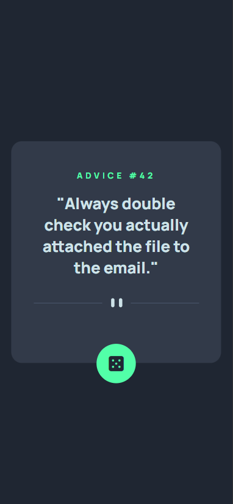

# Gerador de conselhos

Esse foi uma exercício realizado no módulo "Exercícios CSS Avançado - Flexbox" do curso Dev Quest - Dev em Dobro 

#### Dificuldades e aprendizados

A única dificuldade que eu tive foi que eu não estava utilizando a propriedade "transform-y" no botão, o que dificultou na hora de posicioná-lo.

#### Design Desktop

#### Design Desktop
